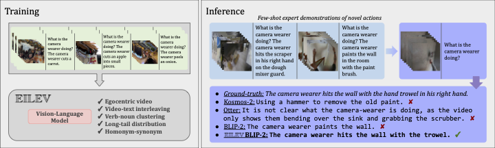

# EILeV: Eliciting In-Context Learning in Vision-Language Models for Videos Through Curated Data Distributional Properties (EMNLP 2024)

[](https://yukw777.github.io/EILEV/)
[](https://arxiv.org/abs/2311.17041)
[](https://a12f-141-212-106-177.ngrok-free.app)



EILeV (**E**mergent **I**n-context **Le**arning on **V**ideos) is a novel training paradigm that induces in-context learning over video and text in vision-language models (VLMs) by capturing key properties of pre-training data without requiring massive, naturalistic video datasets. It is an extension to the preliminary work done in [VideoBLIP](https://github.com/yukw777/VideoBLIP), which contains models trained using EILeV with no in-context examples.

## Setup

```bash
# Clone the repository
git clone git@github.com:yukw777/EILEV.git
cd EILEV

# Install EILEV in editable mode
# Use of virtual environments recommended
pip install -e .
```

## Running Sample Scripts

### EILeV

```bash
# Run `python samples/eilev_generate_action_narration.py --help` for details
# By default, the demo uses `kpyu/eilev-blip2-opt-2.7b`, which requires about 16GB of VRAM.
python samples/eilev_generate_action_narration.py \
  --device cuda \
  demo/examples/dough-mixer.mp4 \
  "Question: What is the camera wearer doing?" \
  "Answer: The camera wearer hits the scraper in his right hand on the dough mixer guard." \
  demo/examples/paint.mp4 \
  "Question: What is the camera wearer doing?" \
  "Answer: The camera wearer paints the wall in the room with the paint brush." \
  demo/examples/trowel.mp4 \
  "Question: What is the camera wearer doing?" "Answer:"
```

### VideoBLIP

```bash
# Run `python samples/video_blip_generate_action_narration.py --help` for details
# By default, the demo uses `kpyu/video-blip-flan-t5-xl-ego4d`, which requires about 16GB of VRAM.
python samples/video_blip_generate_action_narration.py \
  --device cuda \
  demo/examples/bike-fixing-0.mp4 \
  "What is the camera wearer doing?"
```

## Running Demo Locally

### EILeV

```bash
# Install extra packages
pip install -e ".[demo]"

# Run `python demo/eilev_demo.py --help` for details
# By default, the demo uses `kpyu/eilev-blip2-opt-2.7b`, which requires about 16GB of VRAM.
python demo/eilev_demo.py --device cuda
```

### VideoBLIP

```bash
# Install extra packages
pip install -e ".[demo]"

# If you see the following error:
# FileNotFoundError: [Errno 2] No such file or directory: 'ffprobe': 'ffprobe'
# install ffmpeg
sudo apt install ffmpeg

# Run `python demo/video_blip_demo.py --help` for details
# By default, the demo uses `kpyu/video-blip-flan-t5-xl-ego4d`, which requires about 16GB of VRAM.
python demo/video_blip_demo.py --device cuda
```

## Pretrained Weights

### EILeV

- [`kpyu/eilev-blip2-opt-2.7b`](https://huggingface.co/kpyu/eilev-blip2-opt-2.7b)
  - [`Salesforce/blip2-opt-2.7b`](https://huggingface.co/Salesforce/blip2-opt-2.7b) trained using EILeV on on Ego4D.
- [`kpyu/eilev-blip2-flan-t5-xl`](https://huggingface.co/kpyu/eilev-blip2-flan-t5-xl)
  - [`Salesforce/blip2-flan-t5-xl`](https://huggingface.co/Salesforce/blip2-flan-t5-xl) trained using EILeV on Ego4D.

### VideoBLIP

- [`kpyu/video-blip-opt-2.7b-ego4d`](https://huggingface.co/kpyu/video-blip-opt-2.7b-ego4d)
  - VideoBLIP initialized with [`Salesforce/blip2-opt-2.7b`](https://huggingface.co/Salesforce/blip2-opt-2.7b) and fine-tuned on Ego4D.
- [`kpyu/video-blip-flan-t5-xl`](https://huggingface.co/kpyu/video-blip-flan-t5-xl-ego4d)
  - VideoBLIP initialized with [`Salesforce/blip2-flan-t5-xl`](https://huggingface.co/Salesforce/blip2-flan-t5-xl) and fine-tuned on Ego4D.

## Training

**1. Download Ego4D**
You need the `fho` benchmark data from Ego4D. Below is an example command to download it. Please refer to the official [Ego4D website](https://ego4d-data.org/) for more details.

```bash
ego4d --output_directory="<output_dir>" --datasets full_scale annotations --benchmarks fho
```

**2. Extract frames**
Once you have the `fho` benchmark data from Ego4D, run the following commands to split train and validation data and extract frames.

```bash
# First split train and validation data
python scripts/ego4d/split_train_val_test.py \
    path/to/ego4d/v2/annotations/fho_main.json \
    path/to/extracted/frames \
    path/to/ego4d/v2/full_scale

# Extract frames
SPLIT=(train|val|test)
MODEL=<your-base-blip2-model> # e.g., Salesforce/blip2-opt-2.7b
SUBSAMPLE_FRAMES=8
python scripts/ego4d/extract_frames.py \
    --fho_main_path path/to/ego4d/v2/annotations/fho_main.json \
    --split_path path/to/extracted/frames/fho_main_${SPLIT}.json \
    --video_dir path/to/ego4d/v2/full_scale \
    --frames_dir path/to/extracted/frames/fho_main_${SPLIT}_frames-${MODEL}-subsample-${SUBSAMPLE_FRAMES} \
    --model_name_or_path ${MODEL} \
    --num_subsample_frames ${SUBSAMPLE_FRAMES} \
    --num_workers 8 # should be adjusted based on the number of CPUs
```

**3. Train**

- `kpyu/eilev-blip2-opt-2.7b-ego4d`

```bash
# Takes about 1 day and 12 hours on 8 A40s
RDZV_ID=$RANDOM
MASTER_NODE=$(hostname)
torchrun --nproc_per_node=8 --rdzv-id=$RDZV_ID --rdzv-backend=c10d --rdzv-endpoint=$MASTER_NODE \
  scripts/general/train_v2.py \
  --model_name_or_path Salesforce/blip2-opt-2.7b \
  --num_subsample_frames 8 \
  --train_num_in_context_examples_per_sample 16 \
  --val_num_in_context_examples_per_sample 16 \
  --verb_noun_ratio 0.5 \
  --train_frames_dir path/to/extracted/train/frames \
  --val_frames_dir path/to/extracted/val/frames \
  --output_dir path/to/output \
  --num_train_epochs 5 \
  --warmup_steps 0 \
  --learning_rate 1e-5 \
  --per_device_train_batch_size 1 \
  --gradient_accumulation_steps 16 \
  --ddp_find_unused_parameters False \
  --per_device_eval_batch_size 8 \
  --weight_decay 0.05 \
  --dataloader_num_workers <num_cpus> \
  --bf16 True \
  --evaluation_strategy steps \
  --eval_steps 200 \
  --save_strategy steps \
  --save_steps 200 \
  --save_total_limit 3 \
  --logging_steps 10
```

- `kpyu/eilev-blip2-flan-t5-xl`

```bash
# Takes about 1 day and 12 hours on 8 A40s
RDZV_ID=$RANDOM
MASTER_NODE=$(hostname)
torchrun --nproc_per_node=8 --rdzv-id=$RDZV_ID --rdzv-backend=c10d --rdzv-endpoint=$MASTER_NODE \
  scripts/general/train_v2.py \
  --model_name_or_path Salesforce/blip2-flan-t5-xl \
  --num_subsample_frames 8 \
  --train_num_in_context_examples_per_sample 16 \
  --val_num_in_context_examples_per_sample 16 \
  --verb_noun_ratio 0.5 \
  --train_frames_dir path/to/extracted/train/frames \
  --val_frames_dir path/to/extracted/val/frames \
  --output_dir path/to/output \
  --num_train_epochs 5 \
  --warmup_steps 0 \
  --learning_rate 1e-5 \
  --per_device_train_batch_size 1 \
  --gradient_accumulation_steps 16 \
  --ddp_find_unused_parameters False \
  --per_device_eval_batch_size 8 \
  --weight_decay 0.05 \
  --dataloader_num_workers <num_cpus> \
  --bf16 True \
  --evaluation_strategy steps \
  --eval_steps 200 \
  --save_strategy steps \
  --save_steps 200 \
  --save_total_limit 3 \
  --logging_steps 10
```

- `kpyu/video-blip-opt-2.7b-ego4d`

```bash
# Takes about 24 hours on one A40
python scripts/general/train_v1.py \
    --model_name_or_path Salesforce/blip2-opt-2.7b \
    --num_subsample_frames 8 \
    --train_narrated_actions_dir path/to/extracted/train/frames \
    --val_narrated_actions_dir path/to/extracted/val/frames \
    --output_dir <output_dir> \
    --num_train_epochs 5 \
    --warmup_steps 1000 \
    --learning_rate 1e-5 \
    --per_device_train_batch_size 32 \
    --gradient_accumulation_steps 4 \
    --weight_decay 0.05 \
    --dataloader_num_workers 2 \
    --bf16 True \
    --evaluation_strategy steps \
    --eval_steps 200 \
    --save_strategy steps \
    --save_steps 200 \
    --save_total_limit 3 \
    --logging_steps 10
```

- `kpyu/video-blip-flan-t5-xl`

```bash
# Takes about 23 hours on one A40
python scripts/general/train_v1.py \
    --model_name_or_path Salesforce/blip2-flan-t5-xl \
    --num_subsample_frames 8 \
    --train_narrated_actions_dir path/to/extracted/train/frames \
    --val_narrated_actions_dir path/to/extracted/val/frames \
    --output_dir <output_dir> \
    --num_train_epochs 5 \
    --warmup_steps 1000 \
    --learning_rate 1e-5 \
    --per_device_train_batch_size 32 \
    --gradient_accumulation_steps 4 \
    --weight_decay 0.05 \
    --dataloader_num_workers 2 \
    --bf16 True \
    --evaluation_strategy steps \
    --eval_steps 200 \
    --save_strategy steps \
    --save_steps 200 \
    --save_total_limit 3 \
    --logging_steps 10
```

## Errors for EPIC-KITCHENS Videos

While extracting frames, you may encounter the following error on some of the EPIC-KITCHENS videos.:

```
Invalid NAL unit size (1053738930 > 11544).
missing picture in access unit with size 11548
Invalid NAL unit size (1053738930 > 11544).
Error splitting the input into NAL units.
```

This is most likely due to the variable frame rate of some of the videos under low light conditions as described [here](https://github.com/epic-kitchens/epic-kitchens-55-annotations#video-information). The solution is to re-encode them at a constant frame rate by running the following command:

```
ffmpeg -i input_video.MP4 -c:v libx264 -crf 23 -preset medium -r 60 -c:a copy output_video_60fps.MP4
```

The following videos have been re-encoded:

```
P29_05.MP4
P30_08.MP4
```

## Development

```bash
# Install poetry https://python-poetry.org/
curl -sSL https://install.python-poetry.org | python3 -

# Clone the repository
git clone git@github.com:yukw777/EILEV.git
cd EILEV

# Install EILeV using poetry
# Note: if you notice "keyring" related error messages or poetry hanging,
# pelase export the following environment variable.
# More info can be found here: https://github.com/python-poetry/poetry/issues/8623
export PYTHON_KEYRING_BACKEND=keyring.backends.null.Keyring
poetry install --with dev

# Activate the poetry virtualenv
poetry shell

# Install pre-commit hooks
pre-commit install

# Run unit tests to verify the dev installation
pytest
```

## Citing EILeV

```
@inproceedings{yu-etal-2024-eliciting,
    title = "Eliciting In-Context Learning in Vision-Language Models for Videos Through Curated Data Distributional Properties",
    author = "Yu, Keunwoo  and
      Zhang, Zheyuan  and
      Hu, Fengyuan  and
      Storks, Shane  and
      Chai, Joyce",
    editor = "Al-Onaizan, Yaser  and
      Bansal, Mohit  and
      Chen, Yun-Nung",
    booktitle = "Proceedings of the 2024 Conference on Empirical Methods in Natural Language Processing",
    month = nov,
    year = "2024",
    address = "Miami, Florida, USA",
    publisher = "Association for Computational Linguistics",
    url = "https://aclanthology.org/2024.emnlp-main.1137",
    pages = "20416--20431",
}
```

## Acknowledgements

This work was supported in part by the DARPA PTG program HR00112220003. We would like to thank the entire MSPR team for their helpful discussion and feedback. We would also like to thank the anonymous reviewers for their valuable comments and suggestions.
